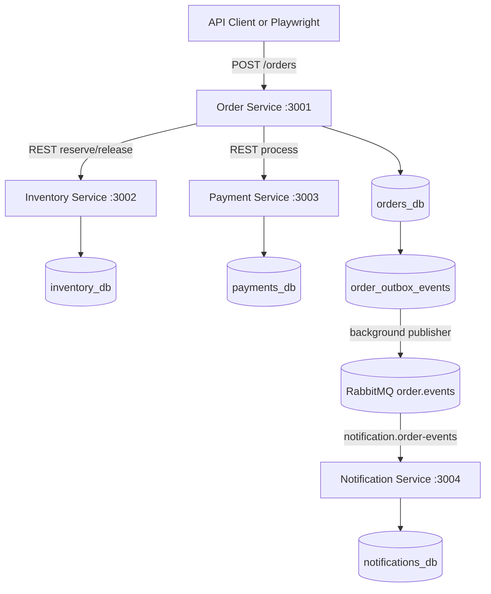
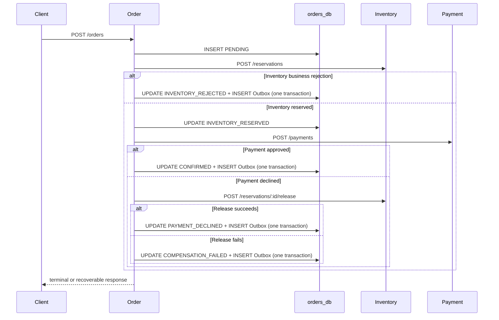

# System Architecture

## 1. Purpose

The Distributed Order Platform is a testable distributed e-commerce workflow. It combines synchronous REST orchestration with asynchronous terminal Order events, independent service databases, idempotency, compensation, controlled outages, and distributed traceability.

The implemented services are Inventory, Payment, Order, and Notification. PostgreSQL hosts four independently owned logical databases, while RabbitMQ transports terminal Order events.

## 2. System context



Order orchestrates the business workflow. Notification is consumer-driven and exposes only `GET /health`; tests validate its persisted state directly in its owned database.

## 3. Synchronous Order workflow

`POST /orders` first persists `PENDING`. Order reserves Inventory and, after success, persists `INVENTORY_RESERVED` before processing Payment. Requests propagate `X-Correlation-Id` and use deterministic internal idempotency keys for reservation, payment, and release.



`PENDING` and `INVENTORY_RESERVED` are recoverable and do not create terminal events. Inventory or Payment technical failures preserve those states for external idempotent replay. `INVENTORY_REJECTED`, `CONFIRMED`, `PAYMENT_DECLINED`, and `COMPENSATION_FAILED` are terminal.

## 4. Transactional Outbox

Publishing directly after a database commit creates an unsafe dual write: the Order can commit while RabbitMQ publication fails. Instead, each conditional terminal update and its `order_outbox_events` insert use the same PostgreSQL client and transaction:

```text
BEGIN
UPDATE orders ... WHERE current state is expected
INSERT order_outbox_events ...
COMMIT
```

If either statement fails, both roll back. A foreign key keeps the event tied to its Order, while `UNIQUE (aggregate_id)` enforces the current rule of one terminal event per Order even during replay or concurrency.

The Outbox stores the versioned payload, event and aggregate IDs, correlation ID, creation/publication timestamps, attempt count, and a sanitized error category. It never stores broker credentials or stack traces.

## 5. Event contract

The executable contract is [order-event.v1.schema.json](../contracts/events/order-event.v1.schema.json). Notification compiles this exact JSON Schema with Ajv in strict mode before consuming messages.

```json
{
  "eventId": "UUID",
  "eventType": "ORDER_CONFIRMED",
  "eventVersion": 1,
  "occurredAt": "2026-08-20T12:00:00.000Z",
  "correlationId": "correlation-value",
  "orderId": "UUID",
  "data": {
    "status": "CONFIRMED",
    "sku": "ORDER-EVENT-CONFIRMED-001",
    "quantity": 2,
    "amountInCents": 5990,
    "currency": "BRL",
    "failureCode": null
  }
}
```

The four allowed mappings are:

| Event type | Required status | Failure code |
| --- | --- | --- |
| `ORDER_CONFIRMED` | `CONFIRMED` | `null` |
| `ORDER_INVENTORY_REJECTED` | `INVENTORY_REJECTED` | final Inventory business code |
| `ORDER_PAYMENT_DECLINED` | `PAYMENT_DECLINED` | final Payment decline code |
| `ORDER_COMPENSATION_FAILED` | `COMPENSATION_FAILED` | `INVENTORY_COMPENSATION_FAILED` |

The envelope intentionally excludes payment tokens, external/internal idempotency keys, reservation/payment IDs, request fingerprints, credentials, and connection details.

## 6. RabbitMQ topology and publisher

The durable topology is:

| Resource | Name/type |
| --- | --- |
| Exchange | `order.events`, topic, durable |
| Routing keys | `order.confirmed`, `order.inventory_rejected`, `order.payment_declined`, `order.compensation_failed` |
| Consumer queue | `notification.order-events`, durable |
| Dead-letter exchange | `order.events.dlx`, topic, durable |
| Dead-letter queue | `notification.order-events.dlq`, durable |

The Order background publisher is non-blocking at HTTP startup. It reads a small pending batch ordered by `created_at ASC, event_id ASC`, provisions the topology, and publishes persistent messages with `mandatory: true` on a confirm channel. Only a positive publisher confirm without a returned message marks `published_at`.

Broker, publish, or routing failure keeps the row pending, increments `publish_attempts`, stores one of `BROKER_UNAVAILABLE`, `PUBLISH_FAILED`, or `UNROUTABLE_MESSAGE`, closes stale resources, and retries on the configured interval. RabbitMQ downtime therefore does not make Order unhealthy and does not turn a completed business request into `503`.

Shutdown stops scheduling, lets the active poll finish, then closes the known channel and connection before the database pool.

## 7. Notification consumer

Notification connects with manual acknowledgements and `prefetch(1)`:

```text
delivery -> JSON parse -> JSON Schema validation -> BEGIN
         -> INSERT notification -> COMMIT -> ACK
```

`notifications.event_id UNIQUE` is the idempotency boundary. A repeated valid `eventId` performs no second insert and is ACKed as a duplicate.

Malformed JSON or schema-invalid data receives `nack(requeue=false)` and is dead-lettered. It creates no Notification and does not stop later valid deliveries. A transient database error receives `nack(requeue=true)`; the consumer then closes its connection and reconnects after a bounded interval, avoiding an aggressive in-process hot loop.

Notification persists stable internal messages rather than sending real e-mail or SMS. `GET /health` returns `UP` only when both `notifications_db` and RabbitMQ are available and never exposes connection details.

## 8. Consistency and delivery semantics

The platform guarantees:

* atomic terminal Order state plus Outbox insertion;
* durable broker topology and persistent messages;
* publication state only after publisher confirm;
* automatic retry/reconnect from persistent Outbox state;
* at-least-once delivery;
* idempotent Notification persistence by event ID;
* poison-message isolation through the DLQ;
* end-to-end correlation ID from the request that produced the terminal transition.

It does not guarantee exactly-once delivery. A crash after RabbitMQ confirms but before `published_at` commits can publish the same event again, which is why consumer idempotency is mandatory. Pending events are read in creation order, but ordering between different Orders is not guaranteed.

## 9. Data ownership

Each service owns one logical PostgreSQL database:

* Order owns `orders_db` and its Outbox;
* Inventory owns `inventory_db`;
* Payment owns `payments_db`;
* Notification owns `notifications_db`.

Application services never write across database boundaries. Automated tests may query multiple databases only to verify distributed consistency. Test setup safely creates `notifications_db` when an existing Docker volume predates it, without destroying volumes.

## 10. Test strategy

The normal Playwright suite covers stable API and database behavior in parallel. Event tests use a separate serial configuration because they start exact service PIDs, inspect eventual state by bounded polling, publish controlled RabbitMQ messages, and temporarily stop only the project's RabbitMQ container. Resilience tests are also separate because they require exclusive infrastructure control.

Coverage includes all four event types, schema-negative cases, real workflow delivery, replay, concurrency, duplicate delivery, poison messages, DLQ, consumer downtime, broker downtime, automatic recovery, correlation IDs, database constraints, sanitized logs, health, and selective cleanup.

## 11. Trade-offs and scope boundaries

Transactional Outbox was selected to eliminate the database/RabbitMQ dual-write gap with modest complexity. At-least-once delivery is accepted because the consumer has a simple durable uniqueness boundary. The DLQ prevents invalid messages from consuming retry capacity.

The current scope deliberately excludes:

* exactly-once delivery;
* global ordering;
* real e-mail, SMS, or external notification providers;
* exponential backoff and delayed retry queues;
* a Notification CRUD API;
* full distributed tracing infrastructure;
* automatic retry of failed Inventory compensation;
* Kubernetes, cloud deployment, and production authentication.
