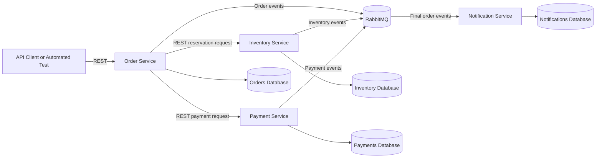
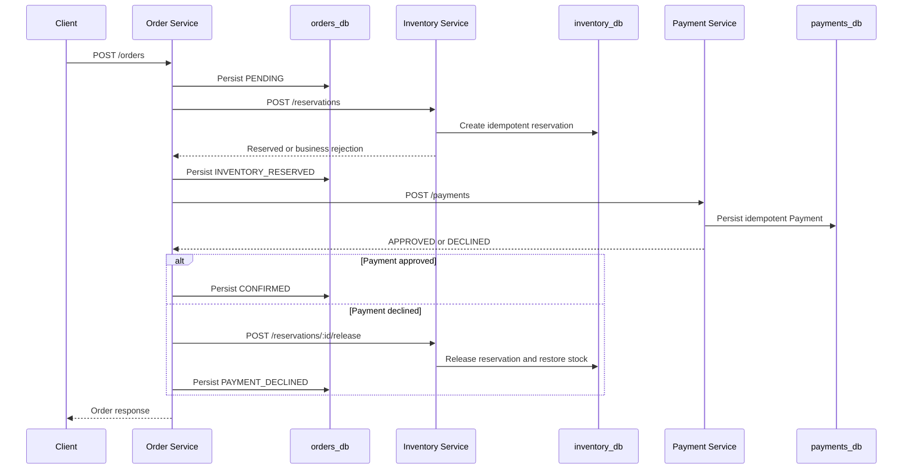
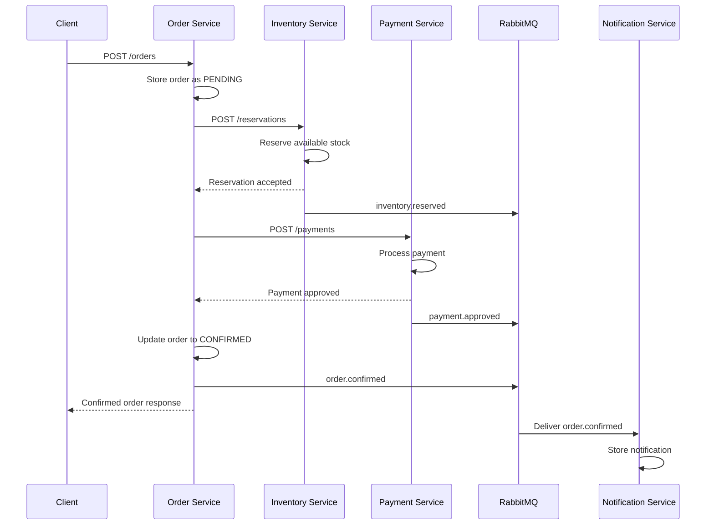

# System Architecture

## 1. Purpose

This document describes the planned architecture of the Distributed Order Platform used in this Quality Assurance portfolio project.

The application will simulate a distributed e-commerce order workflow involving synchronous REST communication, asynchronous events, independent service data, partial failures, retries, idempotency, and distributed traceability.

The architecture is intentionally designed to expose realistic integration risks that can be investigated through manual and automated testing.

> Current implementation boundary: Inventory, Payment, and Order are implemented as independent services. Order orchestrates Inventory reservation, Payment, and Inventory release compensation through synchronous REST. RabbitMQ events and Notification Service remain planned.

## 2. Architecture Style

The platform will use a hybrid orchestration architecture.

The `order-service` will coordinate the main order workflow through synchronous REST requests to the inventory and payment services.

Each service will also publish domain events to RabbitMQ. Final order events will be consumed by the notification service.

This approach allows the project to test both synchronous and asynchronous communication without making the implementation too large for a junior-level portfolio project.

## 3. System Context



## 4. Planned Components

### 4.1 Order Service

The Order Service will be the entry point for creating and consulting orders.

Implemented responsibilities in the current increment:

* accept order creation requests;
* validate the initial order payload;
* prevent duplicate order creation using an idempotency key;
* persist the order and its current status;
* request an inventory reservation;
* request Payment after a successful reservation;
* release Inventory after a Payment business decline;
* propagate the correlation ID to all dependency calls;
* distinguish terminal business outcomes from recoverable technical failures;
* persist conditional, atomic workflow transitions.

Event publication and order-query endpoints remain planned.

Endpoints:

| Method | Endpoint           | Purpose                              | Status      |
| ------ | ------------------ | ------------------------------------ | ----------- |
| `POST` | `/orders`          | Create and process the Order workflow | Implemented |
| `GET`  | `/orders/:orderId` | Retrieve an order                    | Planned     |
| `GET`  | `/health`          | Check service health                 | Implemented |

Order statuses used by the implemented workflow:

* `PENDING`
* `INVENTORY_RESERVED`
* `INVENTORY_REJECTED`
* `CONFIRMED`
* `PAYMENT_DECLINED`
* `COMPENSATION_FAILED`

### 4.2 Inventory Service

The Inventory Service will manage products, available quantities, and reservations.

Implemented responsibilities:

* verify whether a product exists;
* verify whether the requested quantity is available;
* create an inventory reservation;
* prevent duplicate reservations for the same order;
* release a reservation when compensation is required;
* expose inventory and reservation data for validation.

Inventory event publication remains planned.

Implemented endpoints:

| Method | Endpoint                               | Purpose                        |
| ------ | -------------------------------------- | ------------------------------ |
| `GET`  | `/inventory/:sku`                      | Retrieve product stock         |
| `POST` | `/reservations`                        | Reserve inventory for an order |
| `POST` | `/reservations/:reservationId/release` | Release an order reservation   |
| `GET`  | `/health`                              | Check service health           |

Initial reservation statuses:

* `RESERVED`
* `RELEASED`
* `REJECTED`

### 4.3 Payment Service

The Payment Service will simulate payment processing.

Implemented responsibilities:

* receive payment requests;
* apply deterministic payment approval and rejection rules;
* prevent duplicate charges using an idempotency key;
* store payment attempts and their results;
* return business rejections separately from technical failures;
* expose payment data for validation;
* support idempotent calls orchestrated by Order.

Payment event publication remains planned.

Endpoints:

| Method | Endpoint             | Purpose                      | Status      |
| ------ | -------------------- | ---------------------------- | ----------- |
| `POST` | `/payments`          | Process an order payment     | Implemented |
| `GET`  | `/payments/:orderId` | Retrieve payment information | Planned     |
| `GET`  | `/health`            | Check service health         | Implemented |

Initial payment statuses:

* `APPROVED`
* `DECLINED`
* `FAILED`

No real payment provider or real financial transaction will be used.

### 4.4 Notification Service

The Notification Service will consume final order events asynchronously.

Planned responsibilities:

* consume confirmed and cancelled order events;
* create a notification record;
* avoid processing the same event more than once;
* preserve the event and correlation identifiers;
* retry transient consumer failures;
* route unprocessable messages to a dead-letter queue;
* expose stored notifications for test validation.

Planned endpoints:

| Method | Endpoint                  | Purpose                             |
| ------ | ------------------------- | ----------------------------------- |
| `GET`  | `/notifications/:orderId` | Retrieve notifications for an order |
| `GET`  | `/health`                 | Check service health                |

## 5. Main Order Flow

### 5.1 Implemented synchronous Order workflow

The implemented flow persists the Order as `PENDING`, reserves Inventory, and processes Payment. Dependency calls use deterministic internal idempotency keys and propagate the current request's `X-Correlation-Id`.



The state semantics are:

* `PENDING`: the Inventory stage is unfinished and remains recoverable;
* `INVENTORY_RESERVED`: Inventory is reserved, Payment is unfinished, and the Order remains recoverable;
* `INVENTORY_REJECTED`: terminal recognized Inventory business outcome;
* `CONFIRMED`: terminal state with reserved Inventory and approved Payment;
* `PAYMENT_DECLINED`: terminal state with a persisted declined Payment and released Inventory;
* `COMPENSATION_FAILED`: terminal state for this increment when the Payment declined but Inventory release failed.

An Inventory technical failure returns `ORDER_INVENTORY_UNAVAILABLE` while preserving `PENDING`. A Payment technical failure returns `ORDER_PAYMENT_UNAVAILABLE` while preserving `INVENTORY_RESERVED`; replay resumes directly at Payment without reserving stock again. Correlation ID is excluded from the request fingerprint, so recovery can use a new value. The Order Service makes one dependency request per workflow step and has no automatic retry.

### 5.2 Future event-enabled successful order



Expected final state:

* order status is `CONFIRMED`;
* inventory remains reserved;
* payment status is `APPROVED`;
* an `order.confirmed` event exists;
* a confirmation notification is created;
* the same correlation ID can be traced across the operation.

### 5.3 Inventory Rejection

In the implemented Inventory stage, a recognized business rejection behaves as follows:

1. The order is initially stored.
2. Inventory reports an unknown SKU or insufficient stock.
3. Payment must not be requested.
4. The order is updated to `INVENTORY_REJECTED` with the public failure code.

Cancellation events and notifications remain planned.

### 5.4 Payment Decline

When payment is declined:

1. Inventory is successfully reserved.
2. Payment returns a business decline.
3. The order service requests the release of the reservation.
4. Inventory is restored.
5. The order is updated to terminal `PAYMENT_DECLINED` with the Payment decline code.

If release fails technically, the Order becomes terminal `COMPENSATION_FAILED`, the reservation may remain `RESERVED`, and the client receives a controlled `503 ORDER_COMPENSATION_FAILED`. Automatic compensation retry is not implemented yet. Decline and cancellation events remain planned.

### 5.5 Technical Failure

For a technical Inventory failure:

1. The Order remains `PENDING`.
2. The client receives a safe `503 ORDER_INVENTORY_UNAVAILABLE` response.
3. No automatic retry is performed in the same request.
4. Recovery reuses the original payload and external `Idempotency-Key`.
5. Inventory's internal idempotency key prevents duplicate stock reservation.
6. Cross-database validation confirms one Order, one reservation, and one stock increment.

For a technical Payment failure, the Order remains `INVENTORY_RESERVED`, the Inventory reservation is preserved, and no Payment row is assumed to exist. Replaying the original payload and external idempotency key continues directly at Payment and reaches `CONFIRMED` without a second reservation.

## 6. Synchronous Communication

REST APIs will be used for synchronous communication.

Planned request headers:

| Header             | Purpose                                           |
| ------------------ | ------------------------------------------------- |
| `Content-Type`     | Defines the request media type                    |
| `Accept`           | Defines the expected response media type          |
| `X-Correlation-Id` | Identifies the complete distributed operation     |
| `Idempotency-Key`  | Prevents duplicate processing of retried requests |

The `X-Correlation-Id` received by the Order Service is currently propagated to:

* Inventory reservation requests;
* Payment requests;
* Inventory release requests;
* structured logs for the relevant request.

Propagation to RabbitMQ events and Notification remains planned.

When the client does not provide a correlation ID, the Order Service will generate one.

## 7. Asynchronous Communication

RabbitMQ will be used for asynchronous domain events.

Planned exchange:

```text
order.events
```

Planned routing keys:

* `order.created`
* `inventory.reserved`
* `inventory.rejected`
* `inventory.released`
* `payment.approved`
* `payment.declined`
* `payment.failed`
* `order.confirmed`
* `order.cancelled`

A common event envelope will be used:

```json
{
  "eventId": "uuid",
  "eventType": "order.confirmed",
  "eventVersion": 1,
  "occurredAt": "2026-08-05T12:00:00.000Z",
  "correlationId": "uuid",
  "aggregateId": "order-uuid",
  "source": "order-service",
  "data": {}
}
```

Important event validations will include:

* required fields;
* correct data types;
* supported event version;
* valid identifiers;
* correct routing key;
* correlation ID propagation;
* compatibility with JSON Schema;
* duplicate event handling;
* retry behavior;
* dead-letter routing.

## 8. Data Ownership

Each service will own its data.

For local development, a single PostgreSQL container may host multiple logical databases:

* `orders_db`
* `inventory_db`
* `payments_db`
* `notifications_db`

Services must not directly modify another service's database.

Automated database tests may connect directly to databases for validation, but this access is for testing and investigation only.

This separation allows the project to validate:

* service data ownership;
* eventual consistency;
* cross-service inconsistencies;
* compensation results;
* duplicate records;
* missing records;
* correct database constraints.

## 9. Idempotency

Idempotency is required for operations that may be retried.

Implemented examples:

* repeated `POST /orders` requests with the same `Idempotency-Key`;
* repeated reservation requests for the same order;
* repeated payment requests for the same order;
* repeated Inventory release after a Payment decline.

Repeated delivery of the same RabbitMQ event remains planned.

Expected behavior:

* the same logical operation is not executed twice;
* no duplicate order is created;
* stock is not reserved twice;
* payment is not charged twice;
* a notification is not created twice;
* repeated requests return a consistent response;
* conflicts between an idempotency key and a different payload are rejected.

## 10. Retry, Timeout, and Recovery

Order dependency requests have configurable timeouts through `INVENTORY_REQUEST_TIMEOUT_MS` and `PAYMENT_REQUEST_TIMEOUT_MS`. The Order clients do not retry automatically. After a technical failure, `PENDING` resumes at Inventory and `INVENTORY_RESERVED` resumes at Payment through a new client request using the same external idempotency key and payload.

Future retry policies may apply only to transient failures, such as:

* network errors;
* dependency timeouts;
* selected HTTP `5xx` responses;
* temporary RabbitMQ consumer failures.

Retries must not be applied blindly to:

* invalid input;
* authentication or authorization failures;
* inventory rejection;
* payment decline;
* other deterministic business errors.

Retry and timeout values will be configurable so they can be tested without introducing unnecessary fixed waits.

RabbitMQ consumers will use acknowledgements and dead-letter handling so that failed messages are not silently lost.

## 11. Observability and Traceability

Each service will produce structured logs.

Planned log fields:

* timestamp;
* log level;
* service name;
* operation;
* correlation ID;
* order ID, when available;
* event ID, when available;
* HTTP status or event result;
* error type;
* error message.

Sensitive values, payment details, secrets, and credentials must not be written to logs.

The project will validate that one order can be traced across services using the same correlation ID.

## 12. Main Quality Risks

The initial architecture introduces the following quality risks:

1. Duplicate orders caused by client retries.
2. Duplicate inventory reservations.
3. Duplicate payment processing.
4. Payment processing after inventory rejection.
5. Reserved stock not released after payment decline.
6. Order status inconsistent with inventory or payment data.
7. Lost or duplicated RabbitMQ events.
8. Notification created more than once.
9. Unsupported event contract versions.
10. Missing or changed response fields.
11. Incorrect retry of business errors.
12. Requests hanging because of missing timeouts.
13. Missing correlation IDs between services.
14. Sensitive information exposed in logs.
15. Partial system availability producing inconsistent states.

These risks will later be connected to test scenarios and test cases through a traceability matrix.

## 13. Planned Testability Features

The application will include features that make failures observable and reproducible:

* deterministic payment test rules;
* reusable seeded products;
* health endpoints;
* query endpoints for order, reservation, payment, and notification state;
* configurable retry and timeout values;
* structured logs;
* correlation IDs;
* idempotency keys;
* RabbitMQ management interface;
* isolated PostgreSQL databases;
* Docker Compose environment;
* database cleanup or reset scripts;
* reusable automated test data.

These features are part of the application design because software that cannot be observed or controlled is more difficult to test reliably.

## 14. Scope Boundaries

The first project version will not include:

* a graphical web interface;
* real credit card processing;
* real customer personal information;
* Kubernetes;
* cloud infrastructure;
* production-grade authentication;
* multiple regions;
* high-volume production performance targets.

These items are outside the initial scope so the project can focus on integration quality, resilience, messaging, databases, and automated testing.

## 15. Architecture Decisions Summary

* The Order Service will orchestrate the main workflow.
* REST will be used for synchronous dependency calls.
* RabbitMQ will be used for domain events and notifications.
* PostgreSQL will provide persistent service data.
* Each service will own its logical database.
* Idempotency will protect retryable operations.
* Correlation IDs will provide distributed traceability.
* Compensation will restore inventory after a failed payment.
* RabbitMQ consumers will handle duplicates and failed messages.
* All components will be executed locally through Docker Compose.
* Implementation and test evidence will be added incrementally.
